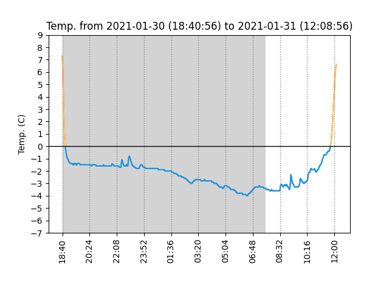

# Python3 script to plot temperature of the Elitech RC-5 data logger

https://www.elitech.uk.com/temperature_logger/Elitech_USB_Temperature_Data_logger_RC_5_147.html

I use the data logger for hiking trips, it will try to get sunrise an sunset times for Europe to plot them onto the temperature curve. 

# Usage

./plot_recent.py CMD

CMD: help, save, plot reset

* save stores the data in ~/Desktop/elitech_fromdate_todate
* plot opens the plotted temperature curve in an external window
* reset removes all data from the device 

# Example

